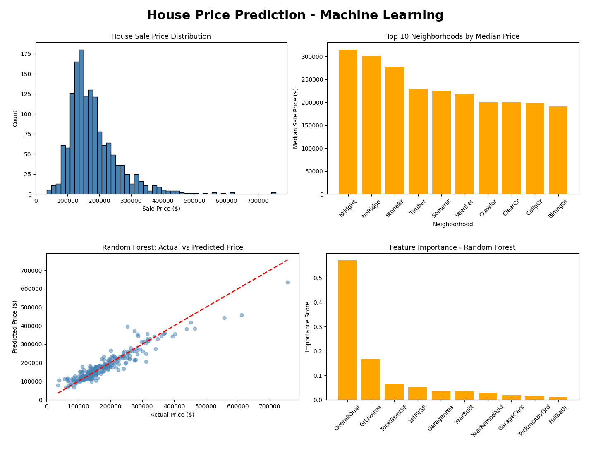

# House Price Prediction - Machine Learning

## Project Overview
Built and compared Linear Regression and Random Forest models to predict house sale prices using 1,460 homes and the 10 features most correlated with price.

## Tools Used
- Python
- Pandas
- Scikit-learn (Linear Regression, Random Forest)
- Matplotlib
- Seaborn

## Model Performance
| Model | R² Score | RMSE |
|---|---|---|
| Linear Regression | 0.797 | $39,475 |
| Random Forest | 0.886 | $29,619 |

## Key Insights

1. Overall Quality has the strongest correlation with sale price (0.79) and accounts for about 57% of Random Forest feature importance
2. Living Area is the second strongest factor, with a correlation of 0.71
3. The most expensive neighborhoods are NridgHt ($315,000 median), NoRidge ($301,500), and StoneBr ($278,000)
4. Random Forest outperformed Linear Regression, reducing typical prediction error by about $10,000
5. Both models underpredict the most expensive homes (above $400,000), likely because there are few high-priced examples to learn from

## Dataset
House Prices - Advanced Regression Techniques (Kaggle competition)

## View Full Project on Kaggle
https://www.kaggle.com/code/lalitacanada/house-price-prediction-machine-learning
